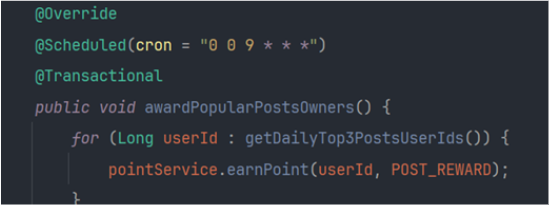

# 프로젝트
---
## Bikers | 바이크 관리 및 커뮤니티 어플리케이션
바이크 관리 및 사용자간 소통을 도와주는 커뮤니티
### 프로젝트 개요
#### 프로젝트 정보
- 프로젝트 기간: 2024.6. ~ 7.
- 프로젝트 인원: Back-end 1명
- Github: [Bikers](https://github.com/dosalpark/bikers)

#### 사용 스킬
- Back-end : Java 17,  SpringBoot 3.3.0,  Gradle
- Database:  MySQL 8.0, Redis 7.2.5
- 인증 및 권한: Jwt, OAuth
- 실시간 통신: WebSocket, STOMP

#### 주요 기능
- JWT Token을 통한 인증/인가
- OAuth(Naver, Kakao) 로그인 구현
- MailSender를 통한 Mail 인증 기능 구현
- WebSocket을 이용한 실시간 채팅 및 채팅기록 저장기능 구현
- 스케줄링을 통한 환경검사 알림 구현
- 이미지 업로드 기능 구현
- 바이크, 바이크모델, 회원, 알림, 게시판, 댓글 CRUD 구현
- OpenAPI 날씨예보 조회 연동

### 기술적 의사결정
- Spring Event [[블로그]](https://pshistory.tistory.com/90)
	- 도메인간 의존성을 낮추기 위하여 **이벤트 기반으로 동작하는 Spring Event 도입**
- Redis [[블로그]](https://pshistory.tistory.com/93)
	- 이메일 인증 번호와 리프레시 토큰을 저장하기위해  **TTL을 지원하며 빠른 성능을 제공하는 in-Memory 데이터베이스인 Redis 도입**
- OAuth [[블로그]](https://pshistory.tistory.com/91)
	- 사용자의 개인정보를 서버에서 보유하지 않고, **접근성을 낮춰 사용자의 경험 개선을 위해 OAuth를 도입**
- QueryDsl [[블로그]](https://pshistory.tistory.com/95)
	- 타입 세이프한 **객체기반 쿼리 작성과 동적쿼리를 생성해서 코드의 재사용성을 높이고, N+1 문제를 해결하기 위해서 QueryDsl 도입**
- WebSocket(STOMP) [[블로그-WebSocket]](https://pshistory.tistory.com/96) [[블로그-STOMP]](https://pshistory.tistory.com/97)
	-  어플리케이션 내의 번개모임이나 정기모임 등 모임을 구성할 때 사용 할 수 있도록 **WebSocket을 통해 채팅기능 도입** 하였고 **분산 서버 환경을 고려해 pub/sub 구조를 가진 STOMP 프로토콜 적용**

---

## pop-corn-talk | 영화리뷰 커뮤니티 서비스 
영화에 대한 리뷰를 주고받고 적립한 포인트로 상품을 교환하는 커뮤니티
### 프로젝트 정보
#### 프로젝트 개요
- 프로젝트 기간: 2024.3.26.~4.30.
- 프로젝트 인원: Back-end 4명
- Github: [pop-corn-talk](https://github.com/pop-corn-talk/pop-corn-talk)

#### 사용 스킬
- Back-end : Java 17,  SpringBoot 3.2.4
- Database:  Mysql 8.0,  Redis 7.1.0
- 인증 및 권한: JWT
- 실시간 통신: SSE
- Infra : Github Actions,  Docker,  AWS ECS(Fargate),  AWS ECR,  AWS Lambda,  
　　　AWS EventBridge,  AWS RDS,  AWS ElastiCache,  AWS S3
- Communication: Slack, Notion, Figma

#### 아키텍처

### 기능 구현
#### 담당 역할
- 게시물, 교환, 상품 도메인 CRUD 구현
- 동시성 제어
- 스케쥴링
- 속도 개선(index, cache)
- Github Actions 기반 CI/CD 적용
- AWS ECR/ECS를 통한 배포
- AWS S3를 활용한 이미지 업로드 기능 구현

#### 담당 외 주요기능
- SSE 이용한 알림서비스 구현
- DB Replication 구현
- JWT Token 통한 인증/인가
- 댓글, 회원, 알림 , 포인트 도메인 CRUD 구현
- 상품, 포인트 로그 도메인 생성

### 기술적 의사결정
- CI/CD 자동화
	- PR 올라온 기능 브랜치 코드가 정상적으로 작동하는 코드인지 확인 필요
	- 반복되는 코드의 수정으로 인해 배포 자동화 필요성 인지
	- MVP 단계에서 빠른 배포를 위해 개발 효율성 비교
	- **별도의 서버 구축 및 유지관리 필요하지 않은 Github Actions 도입**
- 배포
	- 트래픽이 늘어 날 경우, 무중단 배포가 가능한 배포도구 필요
	- MVP 개발 중이므로 러닝커브가 높지 않아야 한다고 생각
	- **AutoScale, 무중단 배포를 제공하며 비교적 러닝커브가 높지않은 AWS ECR/ECS 도입**
- 캐싱
	- 동일 쿼리의 지속적인 요청에 DB의 부하 절감 필요성 인지
	- 변동이 거의 없는 데이터이면서, 메인페이지에 위치해서 잦은 요청이 들어옴
	- **In-Memory기반으로 동작하며, TTL 설정이 가능한 Redis 도입**
- 재고관리
	- 이벤트성 상품에 이용자가 몰릴 때 DB 부하 및 수량의 동시성 제어 필요성 인지
	- Hash 자료구조를 지원해 상품의 PK와 수량을 key-value 관리가 가능하며, 싱글스레드로 동작하여 
	- 동시성 제어되는 Redis 도입
	- **수량이 0이 되거나 일정 시간마다 재고 DB 업데이트**
- 실시간 알림 기능
	- 상품의 교환 및 본인 게시물에 댓글이 달렸을 때 이용자에게 실시간 알림 전송 필요
	- **서버에서 클라이언트로 알림을 실시간으로 보내주면 되기 때문에 단방향 통신인 SSE 도입**
	- 추후 알림을 다시 확인 할 수 있도록 notification 도메인에 알림 내용 저장

### 성능 개선
#### 인덱스를 통한 전체 게시물 조회 속도 개선

1. 전체 게시물 조회 Full Scan 조회 발견 
	메인페이지 접근하면 발생하는 전체 게시물 조회 쿼리의 Explain 결과가 Full Scan 조회하는 것을 확인 
	

2. 정렬 조건 인덱스 설정 
	전체 게시물 조회는 작성일(createdAt) 역순으로 정렬 하고 있어 작성일(createdAt) 인덱스 적용 
	

3. 결과  
	**10만 건의 게시물에 대해 100명의 이용자가 1초에 10번 요청 **
	 	
	 	
	
	|             | 전체 게시물 조회 요청 |
	| ----------- | ------------------- |
	| 적용 전(TPS) | 33.2/sec            |
	| 적용 후(TPS) | 259.1/sec           |
	| 결과         | **TPS 7.8배 향상**   |
			
#### Redis Cache 이용한 DB 부하 감소 및 속도 개선

1. log를 통해 자주 사용되는 쿼리 확인 
	메인페이지 접근하면 발생하는 Best 3 게시물 조회 쿼리와 공지 게시물 조회하는 쿼리가 자주 조회 되는 것을 확인 	
	

2. Redis Cache 적용 
	지난달의 Best 3 게시물을 조회하는 쿼리로 결과에 변동이 적다는 판단 및 자주 조회되는 공지게시물에 대해서 Redis Cache 적용 
	

3. 결과 
	**각 요청을 100명의 이용자가 1초에 10번 요청 캐시히트로 조회 쿼리 최초 1회 발생하여 DB 부하 감소 및 TPS 향상 **
	 	
	 

	|             | Best3 게시물 조회 요청 | 공지 게시물 조회 요청 |
	| ----------- | -------------------- | ---------------------|
	| 적용 전(TPS) | 56.8/sec            | 57.6/sec
	| 적용 후(TPS) | 648.9/sec           | 641.4/sec
	| 결과         | **TPS 11.4배 향상**  | **TPS 11.1배 향상**   |

#### Redis Hash 이용한 상품 수량 관리
1. 상품 교환 마다 쿼리 발생 및 수량의 동시성 문제 발생 	
	이벤트성 상품이 생겼을 때 이용자가 몰리면서 잦은 DB 쿼리 및 동시성 문제 발생

2. Redis Cache 이용하여 수량 관리 
	

3. 결과 
	**Redis 싱글스레드의 이점으로 수량의 동시성 문제 해결 및 일정 시간 및 수량이 0일 때 만 DB 업데이트로 DB 부하 절감**

#### DB Replication 이용한 DB 고가용성 강화 및 속도 개선
1. 다중 요청 부하테스트 시 성능 저하  
	다중 요청 부하 테스트 시 복잡한 요청이 지연되면 이후 요청들도 지연됨  
	\* 일반 게시물 입력, 조회, 상품 교환 요청 동시 부하 테스트 진행

2. DB Replication 적용 	
	@Transactional 어노테이션에 따라 읽기 요청은 ReplicaDB에서 조회, 쓰기 요청은 MainDB에서 쓰기 작업 하도록 분산처리 	
	

3. 결과 
	**각 요청을 100명의 이용자가 1초에 10번 요청 DB 고가용성 강화 및 TPS 향상 **
	 	
	 

	|             | 일반 게시물 입력 요청 | 일반 게시물 조회 요청 | 상품 교환 요청 |
	| ----------- | -------------------- | ---------------------| ------------ |
	| 적용 전(TPS) | 23.0/sec           | 23.0/sec              | 21.8/sec      |
	| 적용 후(TPS) | 29.7/sec           | 29.7/sec              | 28.0/sec      |		
	| 결과         | **TPS 29.1% 향상**  | **TPS 29.1% 향상**  | **TPS 28.4% 향상** |             |

### 트러블 슈팅
#### 상품의 동시성 제어 문제 해결
1. 상품 수정 도중 상품이 교환되는 상황 발생  
	관리자가 **상품의 정보를 수정하는 상황에서 락을 설정하지 않아서 상품 교환 요청이 성공**하는 상황이 발생

2. 분산락 설정 
	비관적 락, 낙관적 락을 사용 할 수 있었지만 아래의 이유로 **Redis의 분산락** 및 **Redisson 라이브러리 사용** 하였고 
	상품의 교환, 상품의 수정, 삭제에 적용되어야 하기에 코드의 중복을 줄이고자 **커스텀어노테이션과 AOP 사용**하여 구현

	| Redis 분산락 | In-Memory DB로 조금 더 빠르게 락을 획득 및 해제 가능 | 싱글스레드로 동작 되기에 데드락에 대한 부담이 적음 |
	| Redisson 라이브러리 | pub/sub 방식으로 구현하여 Redis 부하 감소 | 락의 획득 대기시간과 획득 후 점유시간에 대한 타임아웃 기능 구현되어 있음|

	

#### AcessToken 만료 시 유저 인가 문제 해결
1. 이전 발급한 만료된 AcessToken으로 정상으로 인가 처리 진행되는 상황 발생 
	클라이언트에게 RefreshToken 전달하지 않고 Redis Cache에 만 보관하는 상황에서 **AccessToken이 만료 되었을 경우 로그인한 이용자의 PK 값으로만 검증해서 만료된 토큰으로 정상 인가 처리되는 상황 발생**

2. 최근 발급한 AccessToken 저장 및 검증 
	이용자가 최초 로그인 할 때 Redis Cache에 이용자의 RefreshToken, PK, AccessToken저장하고 **AccessToken 만료 시 이용자의 PK와 최근에 발급한 AccessToken이 맞는지 Redis Cache에서 확인** 후 RefreshToken 만료되지 않았다면 새로운 AceessToken 발급

	

#### 포인트 지급 요청 중복 실행 문제 해결
1. 특정 이용자에게 포인트를 지급하는 요청의 중복 실행 발생 
	Best 게시물로 뽑힌 이용자에게 포인트를 지급하는 요청을 @Scheduler 통해서 특정 시간에 자동으로 실행되도록 설정 되어 있음 서버가 Auto-Scale 되면서 여러 서버에서 각각 요청이 실행되는 상황 발생
	
	

2. AWS Lambda, EventBridge를 이용한 스케쥴링 설정 
	Spring Batch 사용하기에는 오버엔지니어링 이라고 판단 간단한 요청 1개 만 실행하면 되서 **서버리스로 운용 할 수 있는 AWS Lambda, EventBridge 이용해 멀티서버 환경에서도 1번만 실행** 되도록 설정
* 정확한 시간에 실행되어야 하는 요청은 아니므로 콜드스타트 이슈는 배제
* 외부 호출하는 경우를 대비해 key 일치 할 때만 실행되도록 설정

	
